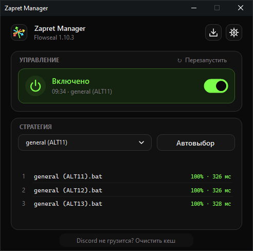

<p align="center">
  
</p>

<h1 align="center">Zapret Manager</h1>

<p align="center">
  <strong>Сам подбирает рабочую стратегию zapret под вашего провайдера — и включает её одним кликом.</strong><br>
  Маленький менеджер для <a href="https://github.com/Flowseal/zapret-discord-youtube">Flowseal zapret-discord-youtube</a> под Windows: без BAT-файлов, без лишних сервисов, один <code>.exe</code>.
</p>

<p align="center">
  <a href="../../releases/latest"><b>Скачать</b></a> ·
  <a href="#как-работает-автовыбор">Как работает автовыбор</a> ·
  <a href="docs/OVERVIEW.md">Устройство проекта</a>
</p>

<p align="center">
  
</p>

## Зачем

У Flowseal около двух десятков стратегий `general*.bat`, и какая из них работает, зависит от провайдера. Обычно их перебирают руками: запустил, открыл YouTube, закрыл, следующая. Zapret Manager делает это сам: проверяет все стратегии, выбирает лучшую и дальше просто держит её включённой — из трея, с автозапуском и обновлениями.

Менеджер намеренно делает одно дело. В нём нет WARP, прокси, собственных стратегий и фоновых служб: только официальный runtime Flowseal, который скачивается с его GitHub при первом запуске.

## Возможности

- **Автовыбор стратегии** — проверка «как у браузера», с перепроверкой финалистов и понятным отчётом по YouTube и Discord.
- **Включение и выключение одним кликом** — из окна или меню трея; иконка трея показывает состояние.
- **Смена стратегии на лету** — контролируемый перезапуск, при ошибке возвращается предыдущая.
- **Обновление Flowseal** — с проверкой пакета, сохранением ваших `*-user.txt`, Game Filter и режима IPSet, откатом при сбое.
- **Автозапуск с Windows** — без окна и без повторного UAC, сразу с последней стратегией.
- **Уведомление, если zapret упал** — клик по нему включает zapret снова.
- **Очистка кеша Discord** — когда после смены стратегии Discord не грузится.
- **Обновляется сам** — и менеджер, и Flowseal; zapret при обновлении менеджера не прерывается.
- **Бережное отношение к системе** — чужие `winws.exe` менеджер никогда не завершает сам; всё хранится в одной папке и удаляется штатно.

## Установка

1. Скачайте `ZapretManager-<версия>-win-x64.exe` со страницы [Releases](../../releases/latest) и запустите его — прямо из «Загрузок».
2. Нажмите **Установить**. Менеджер поставится для текущего пользователя, прав администратора для этого не нужно; ярлыки появятся в «Пуске» и на рабочем столе.
3. Подтвердите UAC — менеджеру нужны права администратора, чтобы запускать zapret. Это единственный запрос за сеанс.
4. Менеджер сам скачает последний релиз Flowseal и проверит его.
5. Нажмите **Автовыбор**, дождитесь результата и включите zapret.

Скачанный файл после установки можно удалить. Требуется Windows 10 или 11 (x64), интернет нужен для установки и обновлений.

> **Windows SmartScreen.** У файла нет цифровой подписи (сертификат стоит денег), поэтому при первом запуске Windows может показать «Windows защитила ваш компьютер». Нажмите **Подробнее → Выполнить в любом случае**. Каждый релиз собирается из исходников в GitHub Actions, а его SHA-256 указан на странице релиза.

**Удаление** — «Параметры → Приложения → Zapret Manager → Удалить». Менеджер остановит свой zapret, снимет автозапуск и удалит папку со всем содержимым.

## Как работает автовыбор

Проверить стратегию «открылся сайт или нет» недостаточно: DPI провайдера ведёт себя по-разному в зависимости от того, *как* выглядит подключение. Поэтому автовыбор старается проверять так же, как это делает настоящий браузер.

**Три этапа.**

1. **Без zapret.** Сначала выясняется, какие адреса действительно заблокированы, а какие недоступны по причинам, которые стратегия не исправит (DNS не находит хост, подменён сертификат). Такие адреса в оценку не входят.
2. **Отсев.** Каждая стратегия запускается и проверяется один раз. Если стратегия не запустилась, прогон не обрывается.
3. **Перепроверка.** Три лучшие стратегии проверяются ещё дважды, в другом порядке — чтобы победителя определял результат, а не случайная потеря пакетов.

**Каждая проверка — два шага, засчитывается только если прошли оба.**

- **TLS-рукопожатие «как у Chrome».** Встроенный TLS Windows 10 (Schannel) умеет только TLS 1.2 и шлёт маленький ClientHello. Chrome, Firefox и Discord шлют TLS 1.3 с приветствием около 1,8 КБ, которое уходит двумя TCP-сегментами. Некоторые стратегии пропускают первое и глушат второе — обычная HTTPS-проверка считает их рабочими, а браузер с ними не работает. Поэтому менеджер собирает такой же ClientHello сам и отправляет его через сырой сокет.
- **HTTPS-запрос с чтением до 64 КБ тела.** Так ловится типичная блокировка «соединение рвётся после 16–20 КБ»: страница начинает грузиться и зависает.

**Как выбирается победитель.** По доле успешных проверок, затем по балансу YouTube/Discord. При равенстве остаётся текущая стратегия — чтобы шум в задержке не менял проверенную на практике. Если ни одна стратегия не лучше работы без zapret, ничего не выбирается.

**Что не проверяется.** Голос Discord и видеопоток YouTube по QUIC идут по UDP — их HTTPS-проверкой не охватить.

Цели берутся из `runtime/utils/targets.txt` Flowseal, при его отсутствии — из встроенного набора. Если DNS провайдера не находит адрес, он берётся через DNS-over-HTTPS. Результат сохраняется и переживает перезапуск.

## Использование

- **Управление.** Клик по строке-переключателю включает или выключает zapret. Кнопка **Перезапустить** видна, пока zapret работает.
- **Трей.** Крестик прячет окно в трей, клик по иконке открывает его обратно. **Выход** останавливает только запущенный менеджером zapret и закрывает приложение.
- **Внешний zapret.** Если zapret уже запущен не менеджером, вместо переключателя появляется **Действия ›**. Остановить можно только службу `zapret` и процессы из текущей папки runtime — и только после подтверждения. Процесс из другой папки нужно закрыть тем, чем он был запущен.
- **Discord не грузится?** Кнопка внизу окна закрывает Discord и удаляет его кеш (`Cache`, `Code Cache`, `GPUCache`) — как `service.bat` из Flowseal. Вход и настройки не затрагиваются.
- **Обновления.** Кнопка со стрелкой в углу окна проверяет новые версии самого менеджера и Flowseal. В настройках можно включить проверку при запуске — тогда придёт уведомление, а установка начнётся только после подтверждения. Новая версия менеджера скачивается с этого репозитория, проверяется по SHA-256 и подменяет себя без остановки zapret.

## Где лежат данные

Всё хранится в папке установки `%LOCALAPPDATA%\Programs\Zapret Manager\`. Кроме неё в системе есть только ярлыки, запись в «Приложениях» и задание Планировщика, если включён автозапуск; удаление убирает всё это.

```
Zapret Manager.exe         сам менеджер
runtime/                   установленный Flowseal
config.json                настройки и результат автовыбора
backups/runtime-previous/  копия runtime для отката обновления
logs/                      технические логи
temp/                      временные файлы обновления
```

## Сборка из исходников

Нужен .NET 8 SDK.

```powershell
dotnet test ZapretManager.sln -c Release
powershell -ExecutionPolicy Bypass -File .\tools\publish.ps1
```

Результат — один файл `artifacts/ZapretManager/win-x64/Zapret Manager.exe`. Стек: C#, WinForms, xUnit. Устройство кода, разработка и выпуск релизов описаны в [docs/OVERVIEW.md](docs/OVERVIEW.md).

## Лицензии и благодарности

Код Zapret Manager распространяется по [лицензии MIT](LICENSE). Сторонние компоненты и их лицензии перечислены в [THIRD_PARTY_NOTICES.md](THIRD_PARTY_NOTICES.md).

Runtime и стратегии разрабатывает [Flowseal/zapret-discord-youtube](https://github.com/Flowseal/zapret-discord-youtube) на основе [bol-van/zapret](https://github.com/bol-van/zapret). Zapret Manager — независимый неофициальный проект, он не связан с авторами Flowseal и не входит в их дистрибутив.
